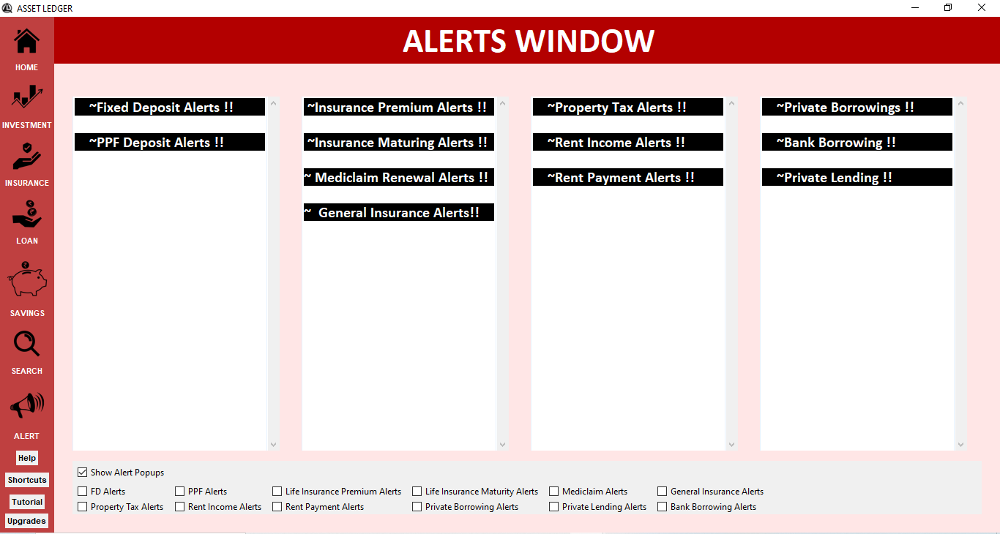
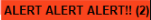

<!-- Google tag (gtag.js) -->

# **ASSET LEDGER**

**Facing problem remembering your assets ?**

**Missing out investment opportunities because you forget the due dates ?**

Only one solution to your problem - "ASSET LEDGER"

This application is a desktop application made for windows and supports windows 7 and upper versions.

.png)

**The latest working version of our application is *Asset Ledger 1.2* dated(19-09-2024)**

Other Versions: Asset Ledger 1.0 , release 14-9-2024

### **What's New**

The latest working version of our application is *Asset Ledger 1.2* dated(19-09-2024)

In this version, we have given users the control to decide what alerts they to be notified about and what not.

Apart from category specific restrictions , if you want to stop seeing every kind of notification , uncheck the "Show Alerts Popup" , you will not be notified about any future alerts untill it is again checked active.

In the above image you'll be able to see the setting in the bottom of the alerts page.

[Click here to download the installer.](https://assetledger.github.io/aboutus/downloads.html)

### **About The App**
It is like a digital passbook which compiles your scattered data at one place for future reference with a user friendly GUI
This application allows you to maintain your data of 4 different categories:

* **Categories**
  - Savings
    - Fixed Deposits
    - Public Providend Funds
    - Savings A/C
    - Sukanya Savings A/C

  - Investments
    - Shares
    - Commodities
    - Property
      
  - Insurance
    - Life Insurance
    - General Insurance
    - Mediclaim
      
  - Loans
    - Private Lending
    - Bank Borrowing
    - Private Borrowing
    
* **Savings**
  - Fixed Deposits
  - Public Providend Funds
  - Savings A/C
  - Sukanya Savings A/C

* **Investments**
  - Shares
  - Commodities
  - Property

* **Insurance**
  - Life Insurance
  - General Insurance
  - Mediclaim

* **Loans**
  - Private Lending
  - Bank Borrowing
  - Private Borrowing

## **APP ALERTS**

The major benefit of our application is the alogirthm of alerting you about any upcoming event (acc. to the date saved by you)
For Eg: Alerting you about a maturing FD or a policy premium to be paid or the date of Loan EMI,etc in a buffer period of 14 days(adjustable) i.e. 7 days before as well as after the date.

* If you want to increase or decrease the buffer period for alerts, it will be done by our in-app customisation procedure **with no extra charges.** You just need to mail us your requirement at assetledgerquerydesk@gmail.com .

The image above depicts the small alerts window which will be displayed on the user's screen at the bottom right corner whenever there is an alert.
This is an auto-start window that do not need any manual initiation.

 
#### **NOTE**
 Please go through the privacy policy of our application.
* **Privacy Policy**
  - No data is saved at cloud servers.
  - All data secured in your local computer drive. Therefore no threat of online leakage of data.
  - No third party data sharing.
  - Almost all textual data is encrypted except the images and the pdfs uploaded on application.
 
* **In-App Customisations**
  - Our support team also cater to your personal demands and any kind of customisations in the app you want.
  - Customisations are chargable and charges may vary from type to type depending on the task.

#### **IMPORTANT**
Always give your correct email and phone number as the security alerts and login activity will be sent on it.
* **Data Retreival** :-
  - When your record is saved , it is stored in a encrypted form and no 3rd party can understand it in stored form.
  - No data can be retreived once damaged or deleted due to our privacy policy of not saving any online cloud backup.
  - But a local backup is saved simultaneously which can be extracted if needed and not destroyed.

* **Encryption** :-
  - All your text data is encrypted by our encryption algorithym but the pictures and pdf documents you upload in the app wont be encrypted.

### **DISCLAIMER**
- All the data uploaded on our application is the choice of the users and we do not promote any illegal activity on our application.
- We do not use any of your data but at the same time we are not responsible for any kind of unethically data usage or theft done any online hacker or so not associated with us.
- The application is a free to use application for everyone till a period of 1 year after setup. And afterwards we reserve the rights to set a renewal fee if required to continue your access.

## **Contact Us**
### **Social Media Handles**
 **Youtube** :- [@ASSETLEDGER ](https://www.youtube.com/channel/UCQs_T-zgMnMY3a4AU0Ps9hw)
 
 **Gmail** :- [assetledgerquerydesk@gmail.com](https://www.gmail.com)

### **Developer**
**Kanishk Gupta**

Mail : assetledgerho@gmail.com
